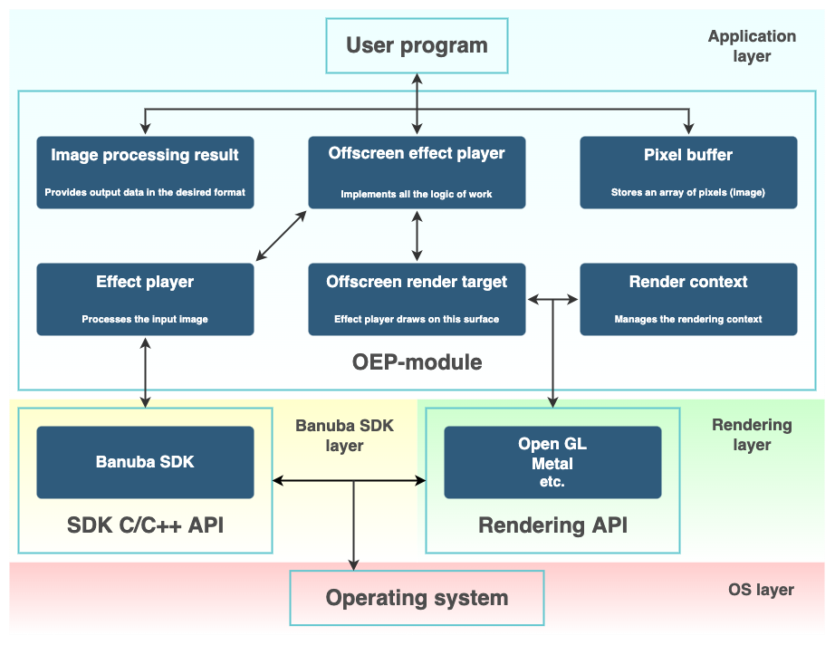
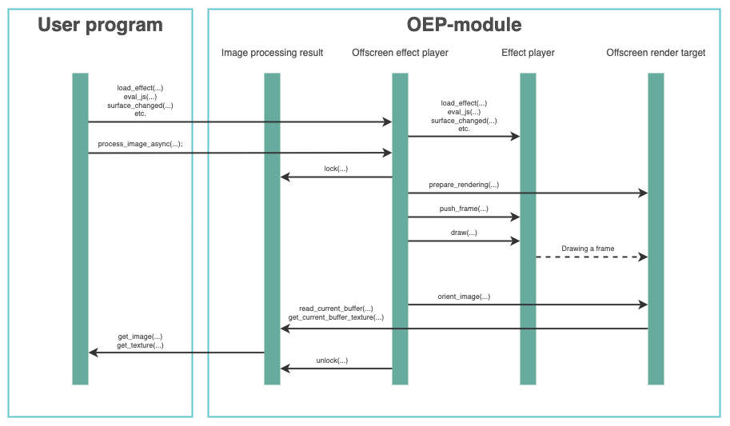

# Offscreen Effect Player module (OEP-module)

[Description of the **Offscreen Effect Player** on the Banuba SDK website](https://docs.banuba.com/face-ar-sdk-v1/core/cpp_api_overview#offscreen-effect-player)

## Description

Common submodule for projects integrating Banuba SDK using C++. This module is independent of the Banuba SDK and represents the implementation of interfaces for  [**Offscreen effect player**](./interfaces/offscreen_effect_player.hpp). The module is a wrapper over Banuba SDK interfaces and provides necessary interfaces for image processing including postprocessing (orientation change, format conversion), and management of effects. This module demonstrates one of the approaches and simplifies integration to the application.

## Folders structure

- [**docs**](./docs/) - illustrations with screenshots and images
- [**interfaces**](./interfaces/) - contains the declaration of offscreen effect player
- [**offscreen_effect_player**](./offscreen_effect_player/) - contains the implementation of the **offscreen_effect_player**, **image_processing_result** and **pixel_buffer** intefaces. The implementation of **offscreen_effect_player** manages the rendering via the **ofscreen_render_target** interface and manages **effect_player** providing the main API for image processing by the Banuba SDK.
- [**offscreen_render_target**](./offscreen_render_target/) - contains the implementation for the **offscreen_render_target** interface. The purpose of this submodule is to provide and manage the graphical context for offscreen rendering. By default, implements OpenGL but can be overloaded on the application level to use other rendering engines. The current implementation is responsible for preparing OpenGL framebuffers and textures for rendering and frame postprocessing (the resulted image conversions and transformations).
- [**opengl**](./opengl/) - OpenGL utilities used by **offscreen_render_target** interface implementation
- [**third**](./third/) - third party libraries

## Description of interfaces

The module by itself implements a piece of image processing conveyor: it accepts image for processing, confgures the offscreen rendering context, pass the image further to the main rendering engine - the Banuba SDK, and after provides the capabilities for image postprocessing. Based on this the module implements only some of the interfaces which do not introduce specifics of a particular API, e.g. Banuba SDK supports C++ API (link) and C API (link), the module doesn't know which API is used for the Banuba SDK management that is why effect_player interface is left unimplemented and its implementation is provided by the application.
- [**effect_player**](./interfaces/effect_player.hpp) - abstraction over Banuba SDK. All interactions with Banuba SDK happen through this interface. Should be implemented on the application side
- [**image_processing_result**](./interfaces/image_processing_result.hpp) - controls the processing for output image in the required format
- [**offscreen_effect_player**](./interfaces/offscreen_effect_player.hpp) - connects all other interfaces into a single whole. The main interface through which the entire pipeline for processing a stream of frames goes.
- [**offscreen_render_target**](./interfaces/offscreen_render_target.hpp) - creates and configures offscreen rendering with required rendering API
- [**pixel_buffer**](./interfaces/pixel_buffer.hpp) - input and output pixel buffer (image). Contains an image in any of the supported formats: [RGB, RGBA, BGR, BGRA, ARGB, nv12, i420](./interfaces/image_format.hpp)
- [**render_context**](./interfaces/render_context.hpp) - platform-specific rendering context. Should be implemented on the application side

## The scheme of interfaces interaction

## The scheme of image processing

## How to integrate OEP-module to the external application

1. Copy [**OEP-module**](https://github.com/Banuba/OEP-module) to your project, or make it as a [**submodule**](https://git-scm.com/book/en/v2/Git-Tools-Submodules);
2. Add to your **CMakeLists.txt** the subfolder that contains the **OEP-module**
3. Write an implementation of the following interfaces: **effect_player** and **render_context**
4. Now you can use the OEP-module in your code

This module is configurable, see [**CMakeLists.txt**](./CMakeLists.txt) for details.
If the logic of the OEP module does not allow you to do what you want, then you can implement interfaces that should have logic that is different from the current implementation. For example by default the OEP module works with OpenGL, if you want to use other rendering API then you have to write your own implementation [**offscreen render target**](./interfaces/offscreen_render_target.hpp) like this [**example**](https://github.com/Banuba/OEP-macos).

## List of examples using the OEP-module

All of the projects listed below have an implementation on the [**CPP-API**](https://docs.banuba.com/face-ar-sdk-v1/core/cpp_api_overview) or on the **C-API**. [**You can read more details here**](https://docs.banuba.com/face-ar-sdk-v1/)
- [OEP-desktop](https://github.com/Banuba/OEP-desktop) Windows and MacOS platforms with using OpenGL and Banuba SDK cpp-API
- [OEP-desktop-c-api](https://github.com/Banuba/OEP-desktop-c-api) Windows and MacOS platforms with using OpenGL and Banuba SDK c-API
- [quickstart-android-c-api](https://github.com/Banuba/quickstart-android-c-api) Android platform with using OpenGL and Banuba SDK c-API
- [agora-plugin-filters-android](https://github.com/Banuba/agora-plugin-filters-android) Android platform with using OpenGL and Banuba SDK cpp-API
- [OEP-macos](https://github.com/Banuba/OEP-macos) MacOS platform with using Metal and Banuba SDK cpp-API
- [OEP_ios_c_api](https://github.com/sdk-banuba/OEP_ios_c_api) IOS platform with using OpenGL and Banuba SDK c-API

## Backward compatibility

If a new version of the Banuba SDK is released, backward compatibility is not guaranteed in full, but the logic of the module remains the same. And in 95 percent of cases, no change is required.
