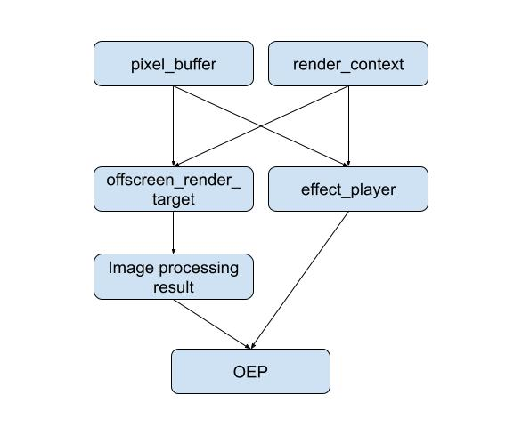
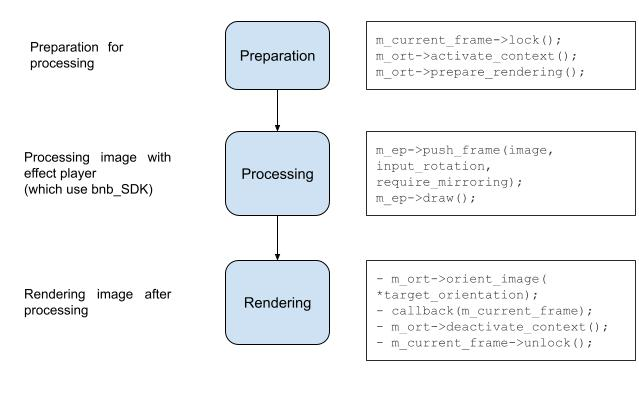

# Offscreen Effect Player module

# Table of Contents

- [Abstract](#Abstract) 
- [Module structure](#Module structure)
- [Integration to the external application](#Integration to the external application)
- [Interfaces interaction](#Interfaces interaction)
- [Image processing](#Image processing)
- [Backward compatibility](#Backward compatibility)
- [References](#References)

## Abstract

Common  **offscreen_effect_player** (OEP) submodule, 
which provides processing a stream of frames.
OEP consist of interfaces, some of them are implemented, 
another should be implemented on the application side. 

This module is configurable, see CMakeLists.txt for details.

## Module structure

Interfaces of EOP are declared in **interfaces**
folder. 

There are six interfaces in OEP:

- **offscreen_effect_player** - The main interface through which the entire pipeline for processing a stream of frames goes.
  The implementation connects all interfaces into a single whole

- **effect_player** - interaction with the effect player.
  Should be implemented on the application side

- **image_processing_result** - output image processor 
in the required format

- **offscreen_render_target** - creation and configuration offscreen rendering

- **pixel_buffer** - input and output pixel buffer (image)
- **render_context** - platform-specific rendering context. 
Should be implemented on the application side

Content of other folders:

- **offscreen_render_target** - an implementation option 
for the offscreen_render_target interface.  Uses the OpenGL renderer.
Allows to prepare gl framebuffers and textures for receiving 
a frame from gpu, receive bytes of the processed frame 
from the gpu and pass them to the cpu, as well as, 
if necessary, set the orientation for the received frame. 
This implementation uses GLFW to work with gl context
- **offscreen_effect_player** - an implementation 
of offscreen_effect_player, 
pixel_buffer and image_processing_result interfaces.
Pixel_buffer contains an image in any of the supported formats: 
RGB, RGBA, BGR, BGRA, ARGB, nv12, i420.
Some formats in image_processing_result are processed on GPU or CPU side.
- **opengl** - OpenGL utilities
- **third** - used third party libs
- **images** - images for this Readme

Also  **thread_pool** class is used for multithreading: 
the thread_pool chooses a suitable thread
for an asynchronous execution of every task in the task queue.

## Integration to the external application

To integrate the Offscreen effect player into your
application, you need to do such the steps:
1) Copy the submodule folder to your application folder
2) Implement interfaces
   **effect_player** and **render_context** on the application side.
3) Re-implement another interfaces in which there must be logic
   different from the current implementation.

## Interfaces interaction

Interfaces interaction is shown in the diagram below. An arrow from A to B means 
that interface B depends on interface A.

As you can see, only **pixel_buffer** and **render_context**
don't depend on other interfaces. Other interfaces depend on them, 
and OEP interface depends on all of the interfaces.

## Image processing

For image processing method _offscreen_effect_player::process_image_async_ is used.
This method has such parameters:
* ** image** - pointer to pixel_buffer, which contains 
image to process
* **input_rotation** - rotation of the **image** (possible values {0, 90, 180, 270}) 
* **require_mirroring** - boolean flag which **true** 
if mirroring of input image is needed
* **callback** - callback which is called after image processing
* **target_orientation** - rotation of the **image** 
(possible values {0, 90, 180, 270} or null). **Note**: banuba_SDK needs to have a 
180 degrees rotation (?).

In method _offscreen_effect_player::process_image_async_ created a 
image processing task for 
thread_pool. This task will be executed asynchronously. 

The image processing task can be separate into preparation, processing
and rendering as it shown on the diagram below:

## Backward compatibility

Backward compatibility of sample in the case of the new SDK releases

## References

[Banuba SDK Documentation](https://docs.banuba.com/face-ar-sdk/generated/doxygen/html/)

[Banuba Face AR SDK Overview](https://docs.banuba.com/face-ar-sdk-v1/)

